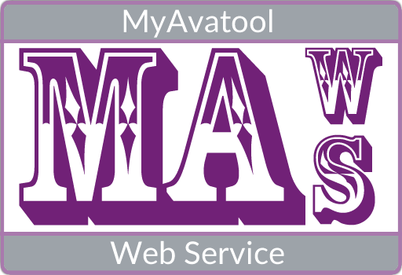

<!-- 220328.094653 -->

<h1 align="center">

  
   
  Roadmap
   
   

</h1>
 

* manual-hosting-maws.md
    * instruction on where to put the files/how to publish
    * updating MAWS
    * Disabling MAWS
    * has to be https

* Update manual to reflect the local methods being removed.
    * Main asmx is just the required methods now
    * All actions are external classes

* Man
    * InptAdmitDate.cs
        * Parser, DefineFieldIds, etc all under main

* Logging

* documentation
    * other projects
    * OO2

* Other abbreviations:
    * Outpatient = outpt 

* Do the $"{}" thing with strings

https://github.com/rcskids/ScriptLinkStandard